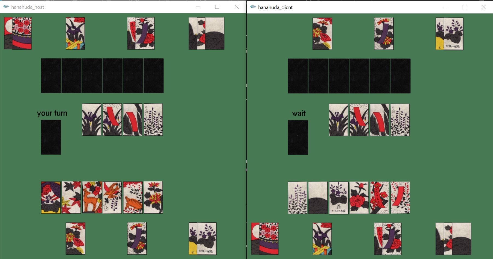

# 2人プレイ用花札「こいこい」

## 概要
5J ネットワークプログラミング2の課題で花札「こいこい」を製作しました. 2人プレイを想定して,
同期通信を行っています. グラフィックはOpenGLを使用しています. 対戦画面は次のような感じです.

## 遊び方
遊び方は<a href="https://www.nintendo.co.jp/others/hanafuda_kabufuda/howtoplay/index.html">任天堂の花札「こいこい」の遊び方</a>と同じですが, 開発の都合により一部ルールを変更しています. 変更点は次の通りです.
- 親の決め方をめくりではなく, server側が親になるように変更
- ゲーム開始時に場に同じ札が3枚以上同じ月の札がある場合, 山札を再度シャッフルし, 札を配り直します.
- めくりで取れる札が2枚以上あるとき, 得点の高い方の札を自動で取得します. 

実装した役は次の通りです.
- 五光(10点)
- 四光(8点)
- 雨四光(7点)
- 三光(5点)
- 花見で一杯(5点)
- 月見で一杯(5点)
- 赤短(5点)
- 青短(5点)
- タネ(5枚のとき1点, その後は1枚増えるごとに1点追加)
- タン(5枚のとき1点, その後は1枚増えるごとに1点追加)
- カス(10枚のとき1点, その後は1枚増えるごとに1点追加)

## 動作環境
動作環境は次の通りです.
- Windows10
- Cygwin 3.1.4-1
- OpenGLとglpngを導入済み

## ビルドと実行方法
ビルド方法を説明します. まず, /mylibフォルダでmakeコマンドを実行します. これはソケット通信のためのライブラリです. 次に/mainのライブラリに移動し, makeコマンドを実行します. make時に次のようなwarningが出ますが問題ありません. これでビルドは完了です.
実行は/mianで行います. サーバー側が./s.exe, クライアント側が./c.exeを実行してください. 実行するとサーバー側が待ち受け状態, クライアント側が接続するホスト名を入力する状態になります. クライアントはサーバーのIPアドレスを入力してください. 

